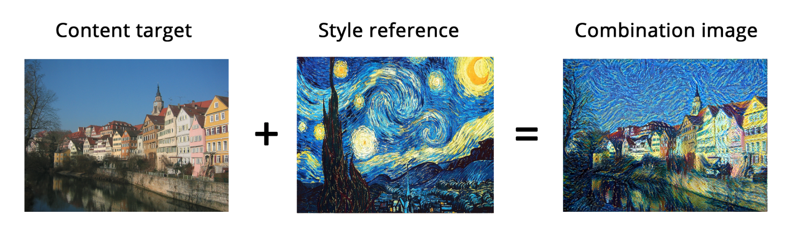

# Neural Style Transfer - Celebrity Comic Book Style Gen AI

This project applies Neural Style Transfer with generative AI models to transform a celebrity face (content image) into a comic book illustration style (style image). It demonstrates the blending of modern deep learning techniques with artistic creativity.

---

## Project Summary

- **Objective:** Transform a real-world celebrity photo into a stylized comic book version using deep learning.
- **Domain:** Computer Vision, Generative Art
- **Techniques:** Neural Style Transfer, Convolutional Neural Networks (VGG19), PyTorch implementation, GIF creation
- **Result:** A blended image combining the celebrity’s features with the artistic characteristics of the comic style

---

## Features

- PyTorch-based implementation for flexibility and control over hyperparameters
- Adjustable style/content weight ratio to fine-tune artistic intensity
- GIF creation from initial content image to stylized image
- Save intermediate results to track transformation progress
- Experimentation with different optimizers and learning rates
- Easily switch style images to experiment with alternative art styles

